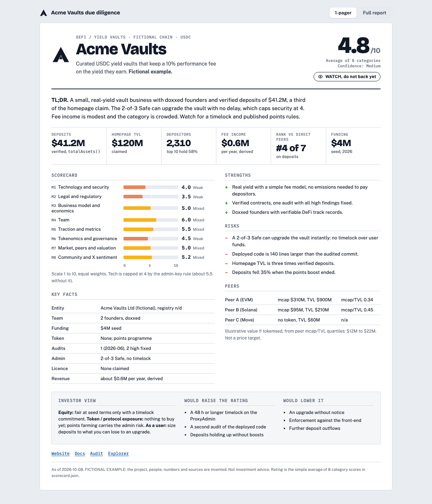
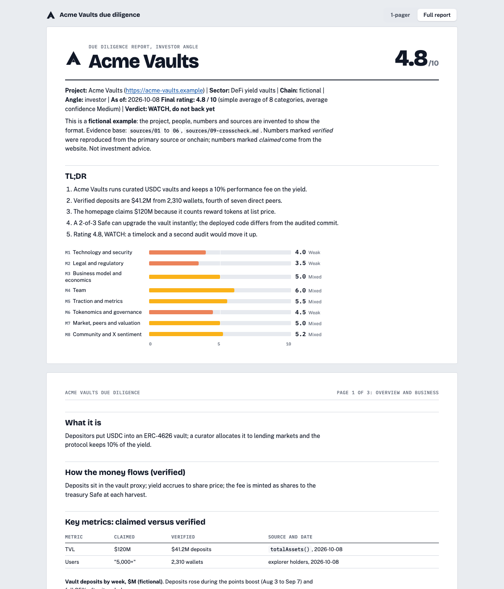
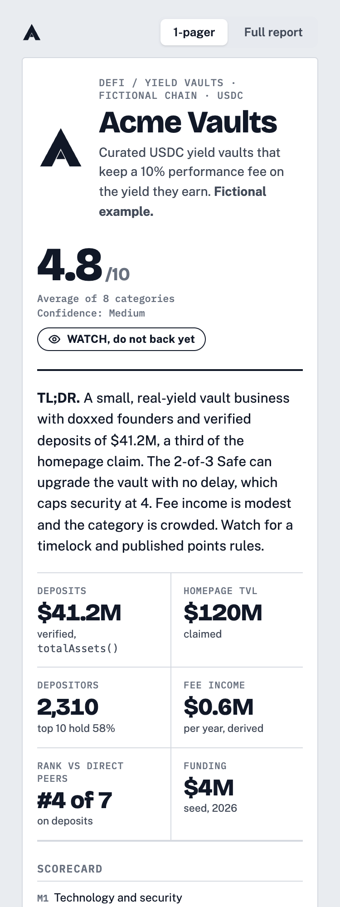

# evm-dd

A Claude Code skill that runs an investor-angle due diligence on a crypto or EVM project and turns it into a scored report plus a one-page tearsheet (web page and A4 PDF).



*The example above is fictional: project, people, numbers and sources are invented.*

## What it does

1. **Asks what you need.** Depth (full or quick scan), whether to run a paid X sentiment pass, output format, angle (investor, user or partner), then links, known leads and conflicts of interest. It summarises the plan and waits for your OK.
2. **Researches in parallel.** Five agents cover technology and security, legal and team, business and traction and token, market and community, and peers across all of web3. Every fact gets a URL, an access date and a confidence level.
3. **Measures X sentiment.** A free reach pass (no key) or a paid Grok pass where every cited post is re-fetched and counted by the scripts, never copied from the model.
4. **Cross-checks.** The lead re-verifies every score-moving fact itself: admin keys and timelocks onchain (read-only), headline numbers from the API or events, registries on the registry.
5. **Scores and writes.** Eight categories from 1 to 10 with caps and confidence, a plain average, a report (TL;DR + 3 pages + scorecard) and a one-page tearsheet that must fit one A4 page.

| Full report tab | Mobile |
|---|---|
|  |  |

## Install

Requirements: [Claude Code](https://claude.com/claude-code), Python 3.9+, curl, Google Chrome or Chromium (for the PDF), and [Foundry](https://getfoundry.sh) `cast` for onchain reads.

```bash
git clone https://github.com/Matteoikarieth96/evm-dd-skill ~/.claude/skills/evm-dd
mkdir -p ~/evm-dd            # the workspace; or set EVM_DD_HOME to another folder
```

Optional, for the paid X pass: put `XAI_API_KEY=...` in `~/evm-dd/.env` (git-ignored, never printed).

Then ask Claude Code:

> Do a DD on https://example-protocol.xyz

## The intake questions

| Question | Options |
|---|---|
| How deep? | Full (5 agents, about 30 to 60 min) / Quick scan / Report only |
| X sentiment? | Free reach-only / Paid Grok pass (about $4 to $15) / Skip |
| Output? | Private web page + A4 PDF / PDF only / Local HTML |
| Angle? | Investor / User / Partner |
| Then | Links, known leads, conflicts of interest, deadline, language |

Details in [`references/intake.md`](references/intake.md).

## Use the scripts directly

```bash
S=~/.claude/skills/evm-dd/scripts
python3 $S/new_project.py acme "Acme" https://acme.example      # scaffold in ~/evm-dd/projects/acme
python3 $S/x_reach.py acmehandle --out ~/evm-dd/projects/acme/sources   # free X reach pass
python3 $S/build.py acme --pdf                                   # page + A4 PDF (fails if the 1-pager overflows)
python3 $S/check.py acme                                         # mechanical QA lint
```

Rebuild the fictional example: `python3 scripts/build.py examples/fictional-protocol --pdf`.

## How it scores

Eight categories, equal weights, simple average: technology and security, legal and regulatory, business model, team, traction, tokenomics and governance, market and peers, community and X sentiment. Caps apply after scoring (for example an instant-upgrade admin key caps security at 4), and a Low-confidence category cannot score above 7. The full method, with field notes from about fifteen real runs (names removed), is in [`references/DD-PROCESS.md`](references/DD-PROCESS.md).

## Security

Fetched content is treated as data, onchain access is read-only, the project's code is never run, keys stay in a git-ignored `.env`, all page text is escaped and only http(s) links survive. See [SECURITY.md](SECURITY.md) for the threat model and residual risks (for example: a project's `charts.py` is executed by the builder).

## Limitations

- It is research, not advice. Ratings are opinions on evidence at a date.
- Agents make mistakes; the cross-check step reduces but does not remove them.
- Paid X sentiment depends on xAI's API and pricing; the free pass measures reach only.
- Some explorers and sites block automated access; the skill does not bypass that.

## Tests

```bash
python3 -m unittest discover -s tests -v
```

## More skills

- [hiring-prep](https://github.com/Matteoikarieth96/hiring-prep-skill): an interview prep page from a company, a role and your resume, with an interactive test
- [beer-can-label](https://github.com/Matteoikarieth96/beer-can-label-skill): full-wrap beer can labels with a 3D can preview
- [3d-print-design](https://github.com/Matteoikarieth96/3d-print-design-skill): parametric parts for FDM 3D printing, checked before export
- [whiteboard-video](https://github.com/Matteoikarieth96/whiteboard-video-skill): hand-drawn whiteboard explainer videos with voice-over

## Licence

MIT
